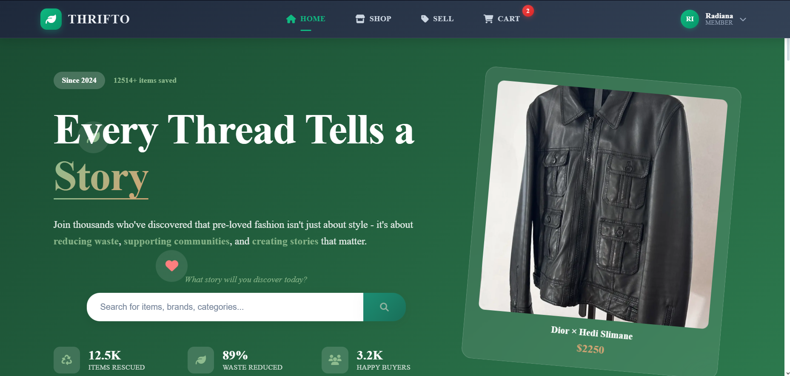
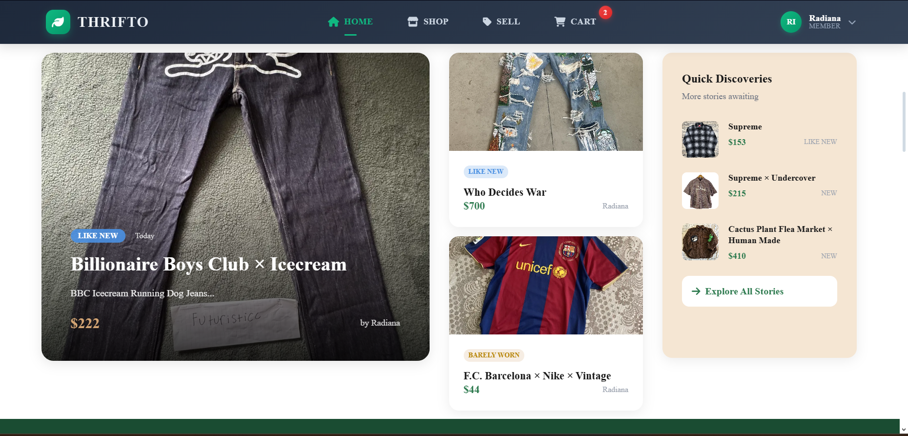
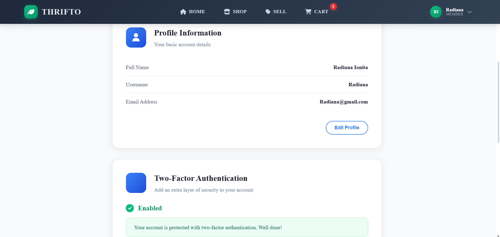
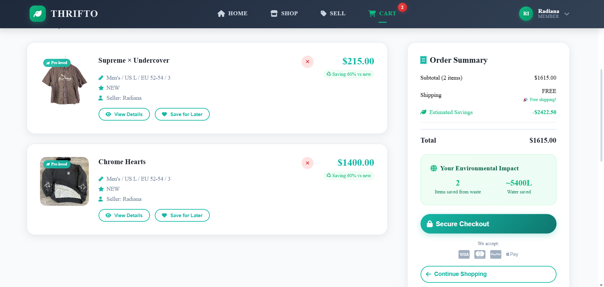
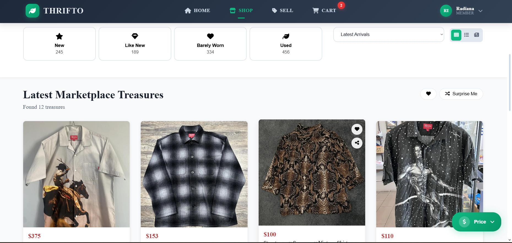

# 🛍️ Thrifto - Premium Sustainable Marketplace Platform

## 🚀 Check the Demo
[](https://youtu.be/kmgUImZh9HE?si=-C0_n2Dd6vf0p26S)






## 🚀 Executive Summary

**Thrifto** represents a sophisticated, enterprise-grade sustainable marketplace platform architected with cutting-edge technologies and modern software engineering principles. This full-stack application demonstrates mastery of contemporary web development paradigms, cloud infrastructure integration, and scalable system design.

Built as a testament to advanced technical proficiency, Thrifto showcases expertise across multiple technology stacks, real-time communication protocols, advanced security implementations, and cloud-native architecture patterns.

---

## 🏗️ Architectural Excellence

### **Frontend Architecture - Angular Ecosystem**
- **Angular 15+** with TypeScript 4.9+ for type-safe, component-based architecture
- **Reactive Programming** leveraging RxJS for asynchronous data streams
- **Modular Design** with lazy-loaded feature modules for optimal performance
- **Progressive Web App (PWA)** capabilities for enhanced user experience
- **SCSS Architecture** with component-scoped styling and design system consistency

### **Backend Architecture - .NET Core Ecosystem**
- **.NET 6+ Web API** following REST architectural principles
- **Clean Architecture** with separation of concerns across layers
- **Entity Framework Core** with Code-First migrations and performance optimization
- **Repository Pattern** with generic implementations for data abstraction
- **Dependency Injection** container for loose coupling and testability

### **Real-Time Communication Stack**
- **SignalR Hubs** for bi-directional real-time messaging
- **WebSocket Protocol** implementation for low-latency chat functionality
- **Connection Management** with automatic reconnection strategies

---

## 🔧 Technology Stack Mastery

### **Frontend Technologies**
```typescript
// Angular CLI Configuration
- Angular Framework 15+
- TypeScript 4.9+
- RxJS for Reactive Programming
- Angular Router for SPA navigation
- Angular Forms (Reactive & Template-driven)
- Angular Material/Custom Component Library
- SCSS/Sass for advanced styling
- Service Workers for PWA functionality
```

### **Backend Technologies**
```csharp
// .NET Core Web API Stack
- ASP.NET Core 6+ Web API
- Entity Framework Core (Code-First)
- AutoMapper for DTO transformations
- JWT Authentication & Authorization
- SignalR for Real-time Communication
- Swagger/OpenAPI for API documentation
- Background Services for async processing
```

### **Database & Storage Solutions**
- **Entity Framework Core** with advanced querying and optimization
- **Database Migrations** with version control integration
- **AWS S3** for scalable file storage and CDN distribution
- **Performance Indexing** for optimized query execution

### **Security Implementation**
- **JWT Token Authentication** with refresh token rotation
- **Two-Factor Authentication** (2FA) with TOTP implementation
- **Role-based Authorization** with granular permissions
- **Input Validation** and sanitization across all endpoints
- **HTTPS Enforcement** and security headers implementation

---

## 🎯 Feature Portfolio

### **🛒 Core E-Commerce Functionality**
- **Advanced Product Catalog** with dynamic filtering and search
- **Shopping Cart Management** with session persistence
- **Listing Management** with photo uploads and editing capabilities
- **Price Range Filtering** with real-time updates
- **Infinite Scroll** pagination for optimal performance

### **💬 Real-Time Communication System**
- **Live Chat Functionality** between buyers and sellers
- **Real-time Notifications** for user engagement
- **Message History** with persistent storage
- **Online Status Indicators** and presence management

### **👤 User Management Ecosystem**
- **Comprehensive Authentication** (Login/Register/2FA)
- **User Dashboard** with analytics and insights
- **Account Settings** with profile customization
- **Security Center** for account protection

### **📱 Progressive Web Application**
- **Offline Capability** with service worker implementation
- **Network Status Monitoring** with graceful degradation
- **Responsive Design** across all device form factors
- **App-like Experience** with native-feeling interactions

### **📊 Business Intelligence**
- **Statistics Dashboard** with key performance indicators
- **Feedback System** with rating and review capabilities
- **Blog Platform** for content marketing and SEO

### **🔒 Enterprise Security Features**
- **Two-Factor Authentication** with TOTP implementation
- **Security Help Center** with best practices guidance
- **Auth Guards** for route protection
- **Request Interceptors** for centralized security handling

---

## 🗂️ Project Structure Excellence

### **Frontend Architecture (Angular)**
```
thrifto.client/
├── src/
│   ├── index.html
│   ├── main.ts
│   ├── styles.css
│   ├── styles.scss
│   ├── app/
│   │   ├── app-routing.module.ts
│   │   ├── app.component.ts
│   │   ├── app.component.html
│   │   ├── app.component.scss
│   │   ├── app.component.css
│   │   ├── app.component.spec.ts
│   │   ├── app.module.ts
│   │   ├── components/             # Feature components
│   │   │   ├── about/
│   │   │   ├── account-settings/
│   │   │   ├── auth/               # Authentication
│   │   │   │   ├── login/
│   │   │   │   └── register/
│   │   │   ├── cart/
│   │   │   ├── chat/               # Real-time messaging
│   │   │   ├── contact/
│   │   │   ├── dashboard/          # User dashboard
│   │   │   ├── edit-listing/
│   │   │   ├── faq/
│   │   │   ├── feedback/
│   │   │   ├── home/
│   │   │   ├── listing-detail/     # Product detail view
│   │   │   ├── new-listings/
│   │   │   ├── policy/             # Policy and blog
│   │   │   │   ├── blog/
│   │   │   │   ├── privacy-policy/
│   │   │   │   ├── return-policy/
│   │   │   │   ├── shipping-policy/
│   │   │   │   └── terms-of-service/
│   │   │   ├── search/
│   │   │   ├── security-center/
│   │   │   ├── security-help/
│   │   │   ├── sell/
│   │   │   └── shared/             # Reusable components
│   │   │       ├── footer/
│   │   │       ├── header/
│   │   │       ├── listing-item/
│   │   │       ├── network-status/
│   │   │       ├── notification/
│   │   │       ├── price-range-filter/
│   │   │       └── search-bar/
│   │   ├── directives/             # Custom directives
│   │   │   └── infinite-scroll.directive.ts
│   │   ├── guards/                 # Route guards
│   │   │   └── auth.guards.ts
│   │   ├── interceptors/           # HTTP interceptors
│   │   │   ├── auth.interceptor.ts
│   │   │   └── error.interceptor.ts
│   │   ├── models/                 # TypeScript models
│   │   │   ├── chat-message.model.ts
│   │   │   ├── feedback.model.ts
│   │   │   ├── listing.model.ts
│   │   │   ├── two-factor.model.ts
│   │   │   └── user.model.ts
│   │   └── services/               # Business logic
│   │       ├── auth.service.ts
│   │       ├── cart.service.ts
│   │       ├── chat.service.ts
│   │       ├── feedback.service.ts
│   │       ├── indexed-db.service.ts
│   │       ├── listing.service.ts
│   │       ├── network.service.ts
│   │       ├── notification.service.ts
│   │       ├── offline-queue.service.ts
│   │       ├── pagination.service.ts
│   │       ├── signalr.service.ts
│   │       └── user.service.ts
│   ├── assets/                     # Static assets
│   │   ├── images/
│   └── environments/              # Environment configs
│       ├── environment.prod.ts
│       └── environment.ts

```

### **Backend Architecture (.NET Core)**
```
Thrifto.Server/
├── Controllers/                # API endpoints
├── Services/                   # Business logic
├── Data/                       # Data access layer
│   ├── Repositories/          # Data abstraction
│   └── Migrations/            # Database versioning
├── Models/                     # Domain entities
├── DTOs/                       # Data transfer objects
├── Hubs/                       # SignalR real-time hubs
└── Attributes/                 # Custom middleware
```

---

## 🚀 Advanced Implementation Highlights

### **Performance Optimization**
- **Lazy Loading** for Angular modules and routes
- **OnPush Change Detection** for optimal rendering
- **Database Indexing** for query performance
- **Caching Strategies** with in-memory and distributed caching
- **Image Optimization** with responsive loading

### **Scalability Patterns**
- **Microservices-Ready Architecture** with clean separation
- **Horizontal Scaling** considerations in design
- **Load Balancing** compatible API structure
- **Stateless Design** for distributed deployment

### **DevOps Integration**
- **CI/CD Pipeline** configuration with GitHub Actions
- **Containerization** ready with Docker support
- **Environment Configuration** management
- **Health Check** endpoints for monitoring

### **Cloud-Native Features**
- **AWS S3 Integration** for file storage
- **RDS Compatibility** for managed database services
- **ECS Task Definitions** for container orchestration
- **CloudWatch** monitoring integration

---

## 🛠️ Installation & Development Setup

### **Prerequisites**
- Node.js 16+ and npm/yarn
- .NET 6+ SDK
- SQL Server or PostgreSQL
- AWS Account (for S3 storage)

### **Quick Start**
```bash
# Clone the repository
git clone https://github.com/914RobbLeustean/Thrifto.git
cd Thrifto

# Backend setup
cd Thrifto.Server
dotnet restore
dotnet ef database update
dotnet run

# Frontend setup
cd ../thrifto.client
npm install
ng serve
```

### **Environment Configuration**
```json
// appsettings.json
{
  "ConnectionStrings": {
    "DefaultConnection": "Your-Database-Connection"
  },
  "JWT": {
    "SecretKey": "Your-JWT-Secret"
  },
  "AWS": {
    "AccessKey": "Your-AWS-Access-Key",
    "SecretKey": "Your-AWS-Secret-Key",
    "BucketName": "Your-S3-Bucket"
  }
}
```

---

## 📈 Technical Achievements

### **Code Quality Metrics**
- **TypeScript Strict Mode** enabled for maximum type safety
- **ESLint & Prettier** configuration for code consistency
- **SonarQube** compatible code quality standards
- **Unit Testing** with Jasmine and Karma frameworks

### **Security Compliance**
- **OWASP Top 10** vulnerability mitigation
- **SQL Injection** protection through parameterized queries
- **XSS Prevention** with input sanitization
- **CSRF Protection** with anti-forgery tokens

### **Performance Benchmarks**
- **First Contentful Paint** optimized loading
- **Core Web Vitals** compliance
- **Mobile-First** responsive design
- **Accessibility (WCAG 2.1)** standards implementation

---

## 🎨 UI/UX Excellence

### **Design System**
- **Material Design** principles with custom theming
- **Component Library** with reusable UI elements
- **Responsive Grid System** for all screen sizes
- **Dark Mode Support** with theme switching

### **User Experience Features**
- **Intuitive Navigation** with breadcrumb trails
- **Loading States** and skeleton screens
- **Error Handling** with user-friendly messages
- **Accessibility Features** for inclusive design

---

## 📱 Mobile-First Implementation

### **Progressive Web App Features**
- **Service Worker** for offline functionality
- **App Manifest** for native-like installation
- **Push Notifications** for user engagement
- **Background Sync** for data synchronization

### **Responsive Design**
- **Mobile-First** CSS approach
- **Touch-Friendly** interfaces
- **Gesture Support** for enhanced interaction
- **Cross-Browser** compatibility

---

## 🔮 Future Roadmap

### **Planned Enhancements**
- **Machine Learning** product recommendations & AI Chat Support
- **Blockchain** integration for authenticity verification
- **Advanced Analytics** with business intelligence
- **Multi-language** internationalization support
- **Payment Gateway** integration (Stripe/PayPal)

---

## 👨‍💻 Developer Profile

This project demonstrates proficiency in:
- **Full-Stack Development** with modern frameworks
- **Cloud Architecture** and deployment strategies
- **Real-Time Systems** implementation
- **Security-First** development approach
- **Scalable System Design** principles
- **DevOps** and CI/CD methodologies

---

## 📄 License

This project is licensed under the MIT License - see the [LICENSE](LICENSE) file for details.

---

## 🤝 Contact & Collaboration

**Project Maintainer**: Leustean Robert 

**Email**: leustean.robertgeorge@gmail.com

---

*Thrifto - Where Sustainability Meets Technology Excellence* 🌱💻
=======

